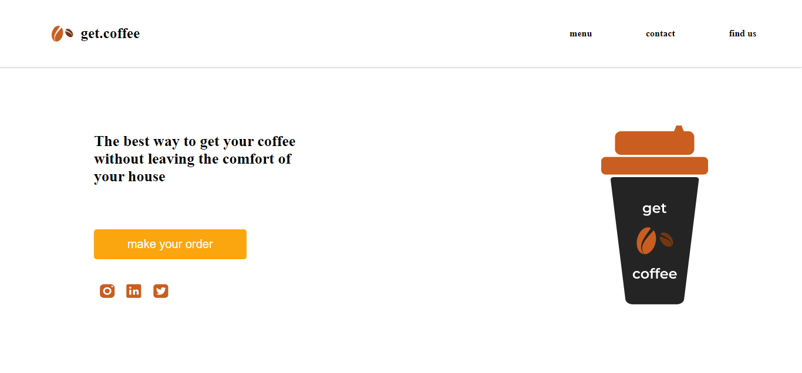

<h1 align="center">
  ☕ Get Coffee Responsivo
</h1>

A get.coffee é uma página simples e responsiva voltada para a venda de café, a página possui interatividade de cores em seus ícones e botões, projetada para exibir em diferentes dispositivos e tamanhos de tela.

---

## Sobre 
O get.coffee é um destino online para todos os amantes de café. Nossa missão é fornecer informações úteis, dicas e truques sobre café, desde a seleção dos melhores grãos até a preparação de uma xícara perfeita em casa. Acreditamos que uma boa xícara de café pode transformar o seu dia, e estamos aqui para ajudá-lo a alcançar essa perfeição.

## Funcionalidades
- **menu**: O cardápio do site está disponível nessa aba, oferecendo uma variedade de resursos e informações sobre cada produto para os amantes de café.
- **contact**: Contatos das redes sociais da página.
- **find us**: Aba que vai direcionar o usuário pra fazer o pedido.

---

## Para o desenvolvimento deste site utilizei as seguintes tecnologias:
- HTML
- CSS
- Figma
- GIT e Github